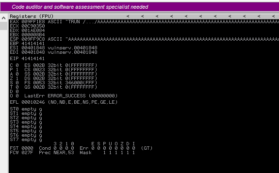

# Buffer Overflow Notes


## Setup

Using a couple of tools:

 - `vulnserver`
   - http://www.thegreycorner.com/2010/12/introducing-vulnserver.html
 - Immunity Debugger
   - https://www.immunityinc.com/products/debugger/

Vulnserver is running in a Windows machine on port 9999. Immunity Debugger runs
on that Windows host as well and attaches to its process. Using a ready-made
vulnerable test server with this debugger allows us to inspect and develop our
understanding of buffer overflow attack vectors, and perhaps implement our own
exploits.

## Weakness Demonstration

We can connect to the vulnserver by issuing the following from Kali:

`nc -nv 192.168.x.x 9999`

Issuing the command `HELP` gives a menu of available functions:

```shell
(UNKNOWN) [192.168.x.x] 9999 (?) open
Welcome to Vulnerable Server! Enter HELP for help.
HELP
Valid Commands:
HELP
STATS [stat_value]
RTIME [rtime_value]
LTIME [ltime_value]
SRUN [srun_value]
TRUN [trun_value]
GMON [gmon_value]
GDOG [gdog_value]
KSTET [kstet_value]
GTER [gter_value]
HTER [hter_value]
LTER [lter_value]
KSTAN [lstan_value]
EXIT
```

We can use the two scripts `stats.pk` and `trun.spk` to demontrate a function
that shows weakness versus one that does not. If we run the `stats.pk` against
the server with:

`generic_send_tcp 192.168.x.x 9999 stats.spk 0 0`

The process will terminate with no discovered overflow. If however we attempt
`trun.spk`:

`generic_send_tcp 192.168.x.x 9999 trun.spk 0 0`

We can observe that Immunity Debugger has paused due to a successful buffer
overflow:




The `ESP` register points to the top of our stack, which grows downwards, and
contains bunk data -- all ASCII `A`'s aka hexcode `0x41`. It contains so many `A`'s
that it has also overwritten the `EBP` (base pointer) and `EIP` (instruction
pointer) registers. The `ESP` and `EBP` are intended to be the bottom and top
bounds of the buffer's stack space, but we've found a function that is vulnerable
to overflow. By managing to overwrite the `EIP` register, we can control where
the stack frame returns to when it closes, effectively giving us arbitrary
control over program execution.

If we can cleverly overflow the stack buffer, and rewrite `EIP` to point to the
`ESP` location, we can then utilize our own stack buffer space for exploitation
code. We essentially infect a vulnerable stack frame with exploit code, malform
its original return address (the `EIP`) to instead recurse back into its own
stack-space, causing it to run our exploit.